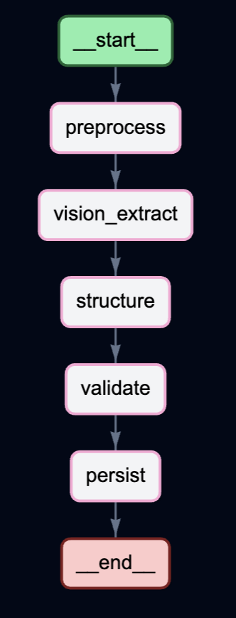
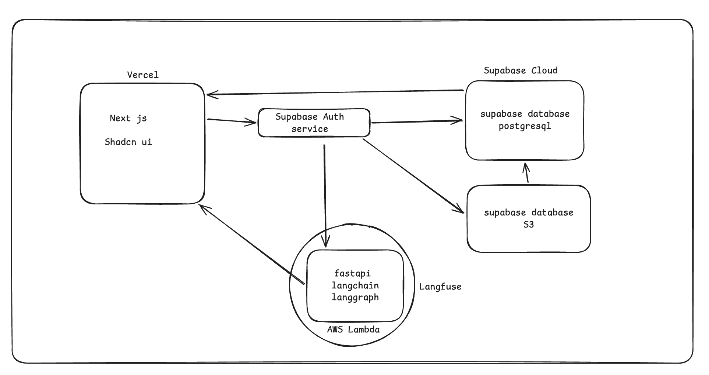
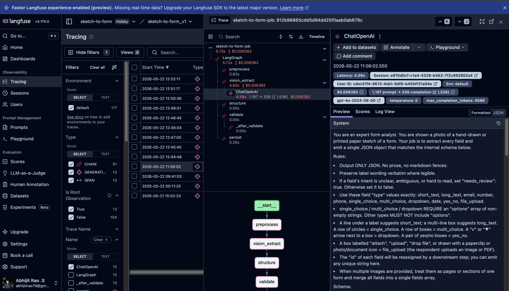
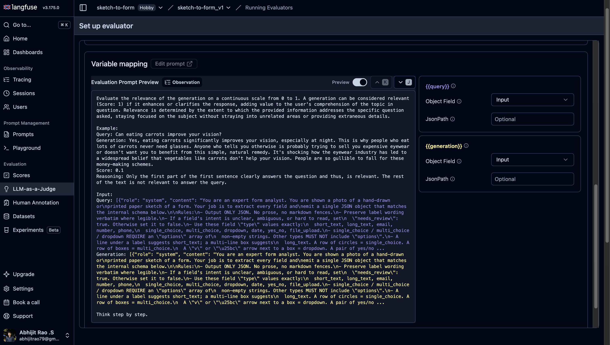
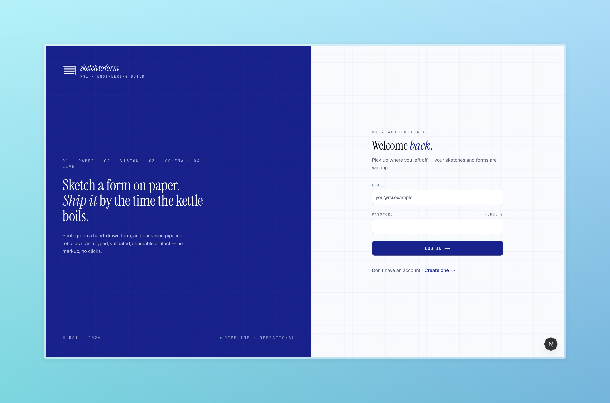

# Case Study 

## Client Problem Statement

### **Business context**  
RSI Geotech runs field surveys across land and project sites. Head office plans each survey in Microsoft Word; site managers print booklets for crews; crews collect data on paper while also using professional gear (drones, GNSS, and similar). Completed booklets flow back through the site manager to head office, where data-entry staff transcribe answers into the database. That chain—Word → print → paper → return → manual entry—is slow, fragmented, and hard to scale.

### **How it works today**

| Step | Who | What happens |
|------|-----|----------------|
| 1 | **Project manager (head office)** | Creates the survey form in **Microsoft Word** and sends it to the site manager. |
| 2 | **Site manager** | **Prints a booklet** from the Word form before the team goes to the location. |
| 3 | **Site manager → site crew** | Hands off the printed booklet so the crew has the paper form on site. |
| 4 | **Site crew (field)** | Runs the survey on location using the booklet **and** field devices (e.g. **drone imagery**, **GNSS**). |
| 5 | **End of day** | Crew returns the completed booklet to the **site manager**. |
| 6 | **Site manager → head office** | Sends the booklet data (and related outputs) back to head office. |
| 7 | **Head office** | **Data-entry team** reads the returned forms and enters information into the company database. |

### **Pain points**

- **Form creation is manual and offline:** Every survey starts in Word, then depends on someone printing and distributing a booklet in time for the job.
- **Paper sits in the middle of a digital workflow:** Crews use modern capture tools (drone, GNSS) but still record key answers on paper that must be re-entered later.
- **Multiple handoffs:** Head office → site manager → crew → site manager → head office → data entry—each step adds delay and risk of loss or error.
- **Double work:** Field teams fill the booklet once; office staff type the same information again into the database.
- **No single internal app** built for how RSI’s survey teams actually plan, run, and close out a site visit.

### **What the client wants**

An internal application that can **generate digital input forms** for the survey team—so field data can be captured in a structured way up front, reducing reliance on manual data entry and closing the gap between “form on site” and “data in the database.”

### **Core goal**  
Replace the Word → print → booklet → manual database entry loop with an internal way to **generate and use digital survey forms**—so head office and field teams share one structured workflow instead of retyping paper at the end.

## Hypothesis and chosen solution

<table width="100%">
  <tr>
    <td width="20%" align="center" valign="middle" style="padding: 0 8px;">
      

        
      

      
<em>LangGraph pipeline</em>

    </td>
    <td width="80%" align="center" valign="middle" style="padding: 0 8px;">
      

        
      

      
<em>Application architecture</em>

    </td>
  </tr>
</table>

**What we believed:** RSI does not need another drag-and-drop form builder. They need to go from a **rough sketch** (how they already plan surveys) to a **digital form** without Word, printing, and retyping at head office.

**What we rejected:** Building only a manual builder (still too slow) or shipping the full app and AI together on day one (too hard to debug when extraction fails).

**What we built — in two steps:**

1. **Phase 1 — AI agent**  
   User uploads a sketch. The agent reads it and returns **JSON**: each question’s type (text, date, dropdown, file upload, etc.), label, and options. Unclear fields are marked for review instead of guessed wrong.

2. **Phase 2 — Web app for RSI**  
   Head office uses a simple interface to upload a sketch, run the agent, **fix** the draft, **publish** a link for field crews, and **read answers** in one place—no paper booklet or manual database entry at the end.

**Why two phases:** Get sketch → JSON working first. Once that output is reliable, wire it into the product RSI’s team actually uses.

## AI-native workflow

I split work by **decisions vs. implementation**:

| Phase | Tool | Why |
|-------|------|-----|
| **Planning** | Claude Code (Opus 4.7) | Turned client interviews into the PRD—scope, user stories, and architecture trade-offs need the stronger reasoning model. |
| **Build** | Cursor (Composer 2.5) | Shipped the LangGraph agent and Next.js app. Composer is cheaper at volume and scores close to Opus on SWE-bench, so it fits day-to-day coding. |

**Rule of thumb:** Opus for *what to build*; Composer for *writing the code*.

### Shared project context

Both tools read the same repo-level instructions so every session starts aligned:

- **`CLAUDE.md`** — architecture, invariants, and commands for Claude Code
- **`.claude/`** — skills and prompts scoped to this project
- **`.cursor/`** — rules and quick reference for Cursor

That setup cut repeated explanations and kept PRD decisions, code style, and Supabase/RLS constraints consistent across planning and build.

## Evaluation and baseline comparison

Before building the full web app, I had to know the sketch agent was working—not just that it returned JSON.

**Before:** I checked a few runs in server logs by hand. Slow, easy to miss mistakes, hard to compare after a prompt change.

**After:** I wired **[Langfuse](https://langfuse.com/)** into the LangGraph job so every run is saved. I can open one trace and see each step (`preprocess` → `vision_extract` → `structure` → `validate` → `persist`), the prompt, model, time, and cost. Retries for the same form stay grouped under one session.

For quality, I used Langfuse **LLM-as-a-Judge** with an OpenAI model to score outputs on a **0–1 relevance** scale—so I did not have to read every JSON by hand. Sample runs on real sketches took about **5–6 seconds** end to end; that was enough to tune prompts and move to Phase 2.

<em>Langfuse trace — each agent step and the vision LLM call</em>

  

<em>LLM-as-a-Judge — automatic relevance scoring on traces</em>

  

## What I Learned and What I Would Improve

**What I learned**

- Start with the big picture—how RSI works today and how the app fits—before writing code. That kept the build focused on their real problem, not a generic form tool.
- Use the right AI model for the task: stronger models for planning (PRD, architecture), faster/cheaper ones for everyday coding.
- Improve in small steps: prove sketch → JSON first, then the web app; add Langfuse when manual checks were not enough.
- Keep the repo “context-ready” (`CLAUDE.md`, `.cursor/`, `.claude/`) so any developer—or AI session—can jump in without starting from zero.

**What I would improve next time**

- Test more sketches earlier, with simple pass/fail checks, before building the full app.
- Write a short how-to for RSI’s team (upload, review, publish, read answers)—not only docs for engineers.
- Show the client a demo after each phase so progress is easy to see, not only in the codebase.

## Production App 
link : https://sketch-to-form.vercel.app/login 

Demo account credentials : 
- Email : sar.abhijit2003@gmail.com
- Password : 123456 

### Interface images

<link rel="stylesheet" href="application_images/readme-carousel.css">

  <input type="radio" name="ui-carousel" id="ui-r1" checked>
  <input type="radio" name="ui-carousel" id="ui-r2">
  <input type="radio" name="ui-carousel" id="ui-r3">
  <input type="radio" name="ui-carousel" id="ui-r4">
  <input type="radio" name="ui-carousel" id="ui-r5">
  <input type="radio" name="ui-carousel" id="ui-r6">

  

    

      
    

    

      
    

    

      
    

    

      
    

    

      
    

    

      
    

  

  <label for="ui-r6" class="arrow prev prev-1" title="Previous">&#9664;</label>
  <label for="ui-r2" class="arrow next next-1" title="Next">&#9654;</label>
  <label for="ui-r1" class="arrow prev prev-2" title="Previous">&#9664;</label>
  <label for="ui-r3" class="arrow next next-2" title="Next">&#9654;</label>
  <label for="ui-r2" class="arrow prev prev-3" title="Previous">&#9664;</label>
  <label for="ui-r4" class="arrow next next-3" title="Next">&#9654;</label>
  <label for="ui-r3" class="arrow prev prev-4" title="Previous">&#9664;</label>
  <label for="ui-r5" class="arrow next next-4" title="Next">&#9654;</label>
  <label for="ui-r4" class="arrow prev prev-5" title="Previous">&#9664;</label>
  <label for="ui-r6" class="arrow next next-5" title="Next">&#9654;</label>
  <label for="ui-r5" class="arrow prev prev-6" title="Previous">&#9664;</label>
  <label for="ui-r1" class="arrow next next-6" title="Next">&#9654;</label>

  

    <label for="ui-r1" class="dot dot-1" title="1"></label>
    <label for="ui-r2" class="dot dot-2" title="2"></label>
    <label for="ui-r3" class="dot dot-3" title="3"></label>
    <label for="ui-r4" class="dot dot-4" title="4"></label>
    <label for="ui-r5" class="dot dot-5" title="5"></label>
    <label for="ui-r6" class="dot dot-6" title="6"></label>
  

